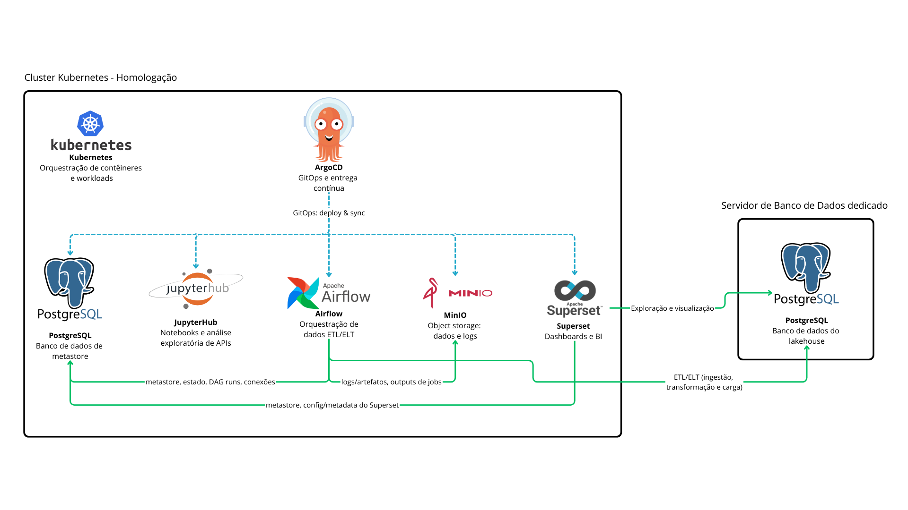

# README - Infraestrutura de Acesso aos Serviços

Este documento descreve as instruções para acesso aos serviços de infraestrutura que estão disponíveis na rede VPN. É necessário que os membros da equipe de infraestrutura disponibilizem acesso à VPN e as credenciais para cada serviço, conforme descrito abaixo.

---

## Pré-requisitos
1. **Acesso à VPN**: Para acessar os serviços mencionados abaixo, é obrigatório estar conectado à rede VPN fornecida pela equipe de infraestrutura.
2. **Solicitação de Credenciais**: As credenciais de cada serviço devem ser solicitadas diretamente à equipe de infraestrutura.
3. **Definição de secrets**: Antes de utilizar os serviços, é necessário definir os secrets de acesso das aplicações, como do airflow ou superset. As secrets necessárias são encontradas nas pastas do repositório, num readme individual para cada aplicação.

---

## Fluxo de dependências
- Segue o fluxo de dependências em imagem:

---

## Serviços Disponíveis

### ArgoCD
- **Descrição**: Ferramenta de GitOps e entrega contínua.
- **Endereço**: `<Definir>`
- **Porta**: `<Definir>`
- **Acesso**: Conectar-se ao host indicado após autenticação via VPN.

### MinIO
- **Descrição**: Serviço de armazenamento de objetos, sendo esses dados e logs.
- **Endereço**: `<Definir>`
- **porta**: `<Definir>`
- **Acesso**: Conectar-se ao host indicado após autenticação via VPN.

### Superset
- **Descrição**: Plataforma de visualização de dados em formato de Dashboards e BI, se conecta ao PostgreSQL interno para aplicar metastore e a config/metadata do Superset.
- **Endereço**: [ipea-superset.lappis.rocks](https://ipea-superset.lappis.rocks/)
- **Acesso**: Acessível pelo navegador, após conexão VPN.

### Airflow
- **Descrição**: Orquestração de dados ETL/ELT, se conecta ao PostgreSQL para aplicar metastore, estado, DAG runs e conexões, se conecta ao MinIO para armazenar logs e outputs de jobs, além de fazer ingestão, transformação e carga de dados para o banco de dados do Lakehouse.
- **Endereço**: [ipea-airflow.lappis.rocks](https://ipea-airflow.lappis.rocks/)
- **Acesso**: Acessível pelo navegador, após conexão VPN.

### Analytics Database
- **Descrição**: Banco de dados para armazenamento e consulta de dados analíticos, do Lakehouse.
- **Endereço**: `<definir>`
- **Porta**: `<definir>`
- **Acesso**: Necessário configurar cliente de banco de dados (como DBeaver) e estabelecer conexão via VPN.

### JupyterHub
- **Descrição**: Notebooks e análise exploratória de APIs.
- **Endereço**: `<definir>`
- **Porta**: `<definir>`
- **Acesso**: Conectar-se ao endereço do host após autenticação via VPN.

---

## Observações Importantes
- **Configuração do DBeaver**: Para quem preferir, o acesso ao banco de dados Analytics pode ser configurado localmente usando o aplicativo DBeaver, sem a necessidade de uma versão compartilhada.
- **Equipe de Suporte**: Em caso de dúvidas sobre a conexão à VPN ou sobre a configuração dos serviços, entre em contato com a equipe de infraestrutura.

---
